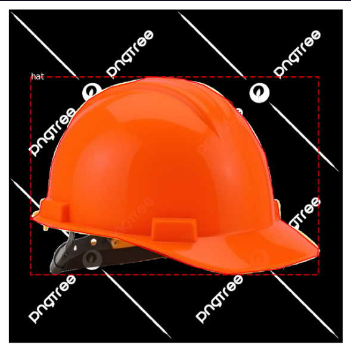
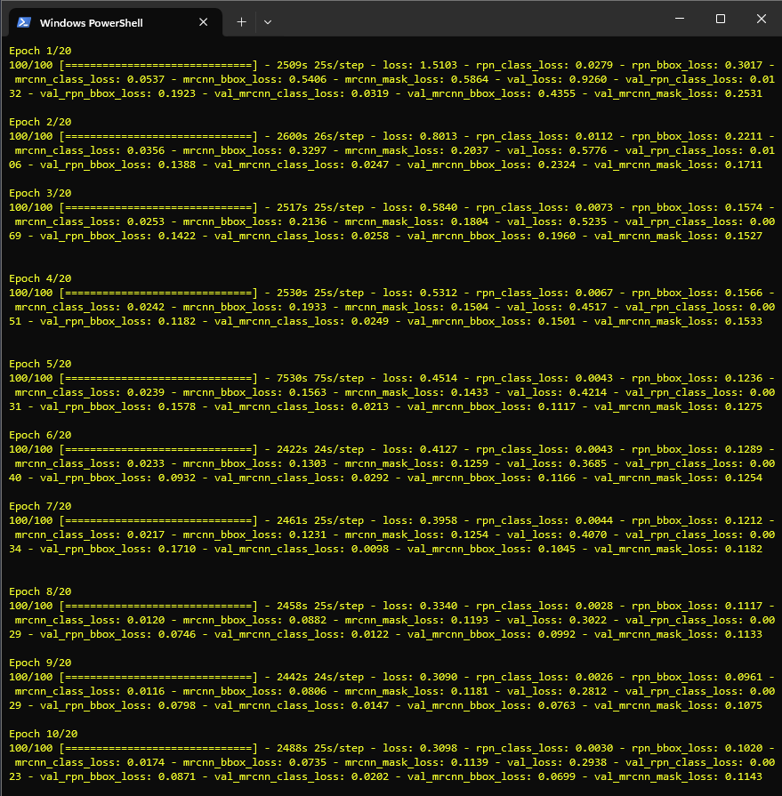
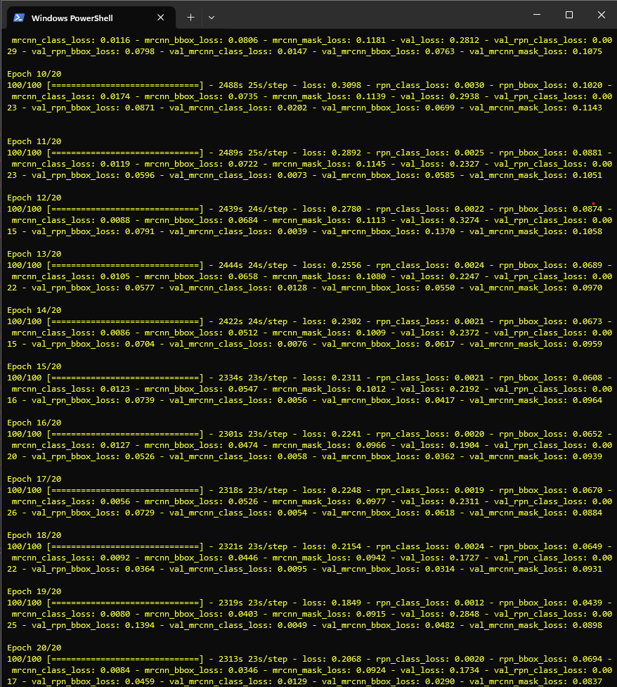
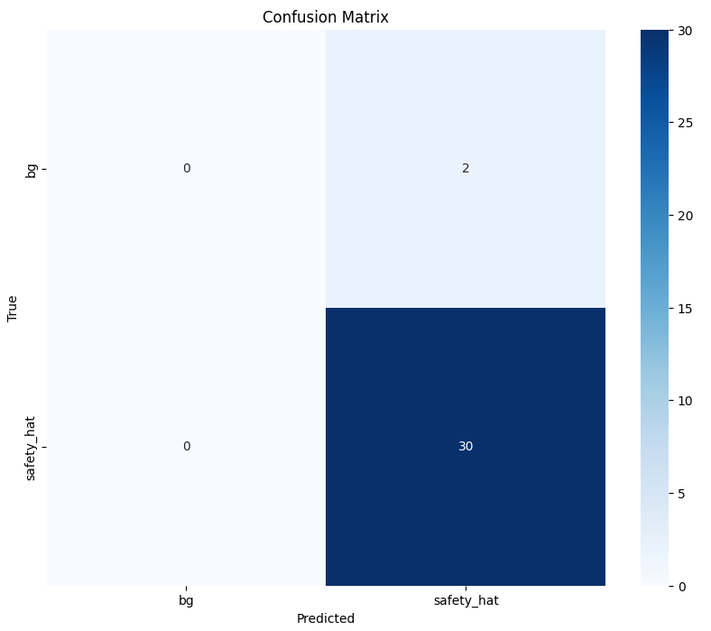
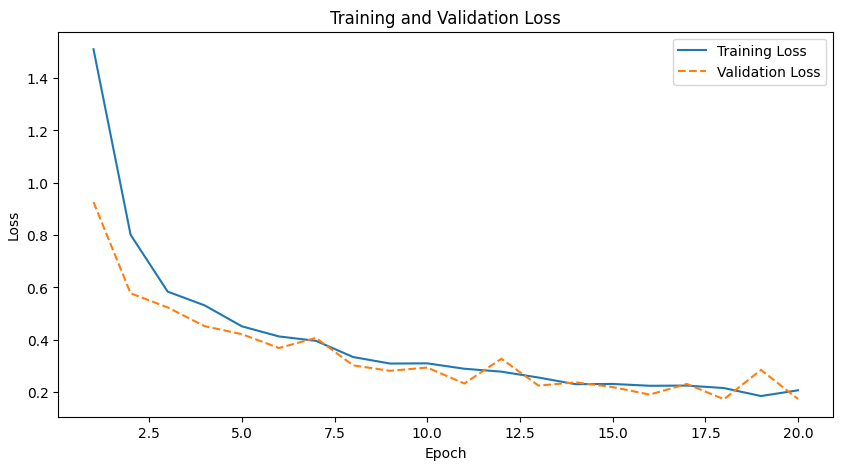

# Safety Hat Detection with Mask R-CNN

## Project Overview
This project focuses on detecting safety hats in images using the Mask R-CNN architecture. The objective is to build a model that accurately identifies and segments safety hats. The dataset contains labeled images for training, validation, and testing, annotated using the VGG Image Annotator (VIA).

- To access the Jupyter notebook of the test with the results, go to [this notebook](samples/hats/test_model_FV.ipynb).
- To access the training script, go to [this script](samples/hats/hats.py).
- To access the datasets, go to [this dataset folder](samples/hats/datasets).
- To access the test images, go to [this test images folder](samples/hats/test_images).


## Table of Contents
- [Project Overview](#project-overview)
- [Dataset](#dataset)
- [Training Logs](#training-logs)
- [Model Configuration](#model-configuration)
- [Evaluation Metrics](#evaluation-metrics)
- [Confusion Matrix](#confusion-matrix)
- [Training and Validation Loss](#training-and-validation-loss)
- [Hyperparameters](#hyperparameters)
- [Testing and Example Outputs](#testing-and-example-outputs)
- [Comments](#comments)
- [Setup Instructions](#setup-instructions)
- [Conclusion](#conclusion)

---

## Dataset

The dataset is organized with separate directories for training, validation, and test images:
- **Classes**:
  - Background
  - Safety Hat
- **Annotations**: Provided in JSON format (generated with VIA), with polygon annotations outlining the safety hats.
- **Number of Labeled Images**: 150 for training and 30 for validation .

### Sample Dataset Extracts

Here are some sample images from each dataset split.

#### Training Images


#### Validation Images



---

## Training Logs

Below are the logs from the training session, with the last line showing the final epoch and loss metrics.
#### Terminal Logs



```
Epoch 20/20 - Loss: 0.2068 - RPN Class Loss: 0.0020 - RPN Bounding Box Loss: 0.0694 - MRCNN Class Loss: 0.0084 - MRCNN Bounding Box Loss: 0.0346 - MRCNN Mask Loss: 0.0924 Validation Loss: 0.1734 - Validation RPN Class Loss: 0.0017 - Validation RPN Bounding Box Loss: 0.0459 - Validation MRCNN Class Loss: 0.0129 - Validation MRCNN Bounding Box Loss: 0.0290 - Validation MRCNN Mask Loss: 0.0837
```

The final log line provides an overview of the model's performance during both training and validation phases:

- **Total Loss (0.2068)**: Training went well; total loss is reasonably low.
- **RPN Class Loss (0.0020)**: Excellent at distinguishing objects from the background.
- **RPN Bounding Box Loss (0.0694)**: Bounding boxes are accurate, but minor room for improvement.
- **MRCNN Class Loss (0.0084)**: Classification is very accurate.
- **MRCNN Bounding Box Loss (0.0346)**: Final bounding boxes align closely with objects.
- **MRCNN Mask Loss (0.0924)**: Good at object segmentation.

###

- **Validation Loss (0.1734)**: Lower than training, indicating good generalization.
- **Validation Losses**: All validation losses are comparable or lower than training, suggesting minimal overfitting and strong model performance on unseen data.

###
For the full log file, check [this log file](samples/hats/training.txt).

For the last line of each epoch, check [this log file](samples/hats/logs.txt).


---

## Model Configuration

The model uses the Mask R-CNN architecture with a custom configuration class. Key configuration parameters include:

- **NAME**: "hat"
- **IMAGES_PER_GPU**: 1
- **NUM_CLASSES**: 2 (1 background + 1 safety hat class)
- **STEPS_PER_EPOCH**: 100
- **LEARNING_RATE**: 0.001
- **DETECTION_MIN_CONFIDENCE**: 0.9 (during training), 0.7 (during inference)

The model was trained for 20 epochs, achieving low validation loss, indicating effective learning and generalization.

---

## Evaluation Metrics

The evaluation was conducted on the validation dataset with a focus on the following metrics:

- **Training Loss**: Demonstrates a steady decrease over epochs, indicating successful learning.
- **Validation Loss**: Low validation loss (0.1734) suggests good generalization on unseen data.
- **Detection Confidence**: Minimum confidence for detection was set to 0.7, yielding high-quality masks and bounding boxes.

---

## Confusion Matrix

The confusion matrix below summarizes the model's performance on the test set:



**Resumee:** The confusion matrix indicates strong performance in detecting safety hats, with 30 true positives and no false positives. However, there are 2 false negatives, suggesting a slight tendency to misclassify the background as a safety hat. Overall, the model demonstrates high precision and recall, with minor room for improvement in distinguishing non-safety hat objects.

### Detailed Metrics per Class
- **True Positives for each class**: `[0, 30]`
- **False Positives for each class**: `[0, 2]`
- **False Negatives for each class**: `[2, 0]`

For the safety hat class specifically:
- **True Positives**: 30
- **False Positives**: 2
- **False Negatives**: 0

This indicates strong performance in detecting safety hats, with no false negatives and minimal false positives.

---

## Training and Validation Loss Graph

The following graph illustrates the training and validation loss across 20 epochs, showing convergence and stability over time.



---

## Hyperparameters

The following hyperparameters were used for the model:

- **Activation Function**: ReLU
- **Learning Rate**: 0.001
- **Optimizer**: Adam
- **Epochs**: 20

Additional hyperparameters, such as batch size and detection confidence, were tuned to optimize model performance.

---

## Testing and Example Outputs

The trained model was tested on unseen images in the `test_images` directory. It produced accurate predictions, displaying clear bounding boxes and mask overlays for detected hats.

#### Test Images


### Example Console Output
```python
Processing 1 images
Image Shape: (1024, 1024, 3), Min: 0, Max: 252
Molded Image Shape: (1, 1024, 1024, 3), Min: -123.7, Max: 148.1
Anchors Shape: (1, 261888, 4)
Average precision of this image: 1.0
Current mean average precision for all images: 1.0
```

### Example of Model Performance on Test Images

For each test image:
- **Bounding Box**: Coordinates around detected safety hats.
- **Class ID**: Identifier for each detected object (1 for safety hat).
- **Confidence Score**: Detection confidence per object.
- **Mask**: Pixel-wise mask for each detected hat.
- **Average Precision**: The model achieved an average precision of 1.0 for each test image, with a mean average precision (mAP) of 1.0 across all test images.

---

## Comments

This model demonstrates high accuracy in detecting safety hats, as shown by the low validation loss and confusion matrix results. The loss curves indicate stable training with minimal overfitting, though a slight increase in validation loss towards the end suggests potential for further optimization. Techniques such as learning rate decay or early stopping could further improve validation accuracy.

---


## Conclusion

The **Safety Hat Detection** model demonstrates strong performance in identifying safety hats across various scenarios, achieving high precision and recall. Further improvements can be made by:

- **Increasing Dataset Size**: Adding more diverse images would help the model generalize better.
- **Enhanced Training Techniques**: Using techniques like data augmentation, learning rate scheduling, or transfer learning can further boost the model's accuracy and robustness.

Overall, the model shows promising results and can be fine-tuned for even higher reliability in real-world applications.
